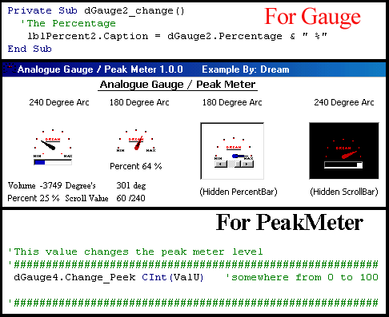



## Analogue Gauge / Peak Meter Usercontrol 29\.5k

### Description

Options for colors: background/gauge pointer(centre,fill,outline). Two gauge angles 180 degrees or 240. Hide/show percent bar(picturebox), scrollbar. Auto disable of user controlable features when in Peak mode. Note: The Background pictures (mostly transparent except for the dots around the gauge edge, the logo in the centre and the Min Max words) ARE 48x48 Icons, you can edit them to your desire (with any icon editor) using the two SPARE Images I provided as templates, to suit your own personal style/preference.
 
### More Info
 

             |
---                |---
**Submitted On**   |2003-06-04 17:23:56
**By**             |[Dream](https://github.com/Planet-Source-Code/PSCIndex/blob/master/ByAuthor/dream.md)
**Level**          |Intermediate
**User Rating**    |4.6 (37 globes from 8 users)
**Compatibility**  |VB 6\.0
**Category**       |[Files/ File Controls/ Input/ Output](https://github.com/Planet-Source-Code/PSCIndex/blob/master/ByCategory/files-file-controls-input-output__1-3.md)
**World**          |[Visual Basic](https://github.com/Planet-Source-Code/PSCIndex/blob/master/ByWorld/visual-basic.md)
**Archive File**   |[Analogue\_G159653642003\.zip](https://github.com/Planet-Source-Code/dream-analogue-gauge-peak-meter-usercontrol-29-5k__1-45949/archive/master.zip)

